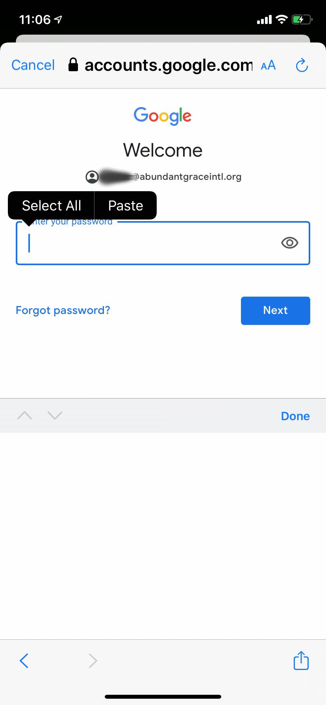

## AGI iPhone email setup documentation

* * *

_(Note: this guide is for iOS 13+ - if you have an earlier version of iOS, you should upgrade if possible)_

### Email from AGI with your email address and password

You should have received an email with your email address and password.

We're going to copy the password out of that email, because it is very long and difficult to type - which makes it secure :smiley:

On your iPhone, open that email:

tap and release your finger on the password, and you'll see a blue selection, with a left and right "handle".

Most likely, the entire password will not all be selected.

Tap on the left "handle" and drag it to the left until the beginning of the password is selected.

Then tap and drag on the right "handle" until the end of the password is selected.

Now the entire password should be selected (highlighted in blue) like this:

Great! Now you need to "copy" the password to the invisible clipboard on your iPhone.

Tap "Copy" in the black bar above the password to copy it.

The bar will disappear.

Now the password is on the invisible clipboard :smiley:

### Settings

Now, launch the Settings app. It looks like a gear or fan icon, like this:

Scroll down and find "Passwords and Accounts"

tap "Passwords and Accounts" and then scroll to the bottom of the next screen (if needed) and tap "Add Account"

Next, on the "Add Account" screen, tap "Google"

A small window will popup, to give google.com access. Tap "Continue"

On the "Google Sign in" screen, type in your @abundantgraceintl.org email address in full, and then tap "Next":

OK, now you will be asked for your password. Remember that invisible clipboard? So does your iPhone.

Tap and release in the password field, and then tap on "Paste" on the black bar that appears above:

*Boom* your password on the invisible clipboard is pasted in, without you having to try to type it! Tap "Next" to continue.

You will be shown Google's terms and conditions. Scroll to the bottom and tap "Accept":

We're nearly there! Now you are shown choices on the services to turn on, from your AGI Google G Suite account.

I recommend you turn on the top three:

* Mail (of course, that's why we're here)
* Contacts (this will sync with your contacts on G Suite)
* Calendar (this will sync wth your calendar on G Suite)

Those last two are very important for your productivity. For example, if you add a calendar event on your iPhone, you can choose which calendar to add it to - your personal calendar OR your Google/AGI G Suite calendar. If you add it to the latter, it will show up in G Suite online and vice versa.

When the slider is "green" it means that service is "on".

Make your choices and tap "Save".

Now you will be brought to your Inbox. If it says "All Inboxes" then it is mixing your personal email account(s) with your AGI G Suite email account.

To see only your AGI email, tap "< Mailboxes" on the top left to see your list of mailboxes, find the AGI Google G Suite mailbox and tap it:

Now you are just seeing your AGI Inbox:

One other tip - if you are viewing "All Inboxes" and compose a new email, be sure to look at the "from" line - it will randomly choose one of your email addresses. If it chooses the wrong one, tap it and choose another.

When replying to email, it will reply from the email address where the email was received, by default.

Enjoy your new AGI Google G Suite email!

* * *

This documentation lives here: https://flaxton.github.io/AGI-iPhone-email/

copyright &copy; 2020 Abundant Grace International

